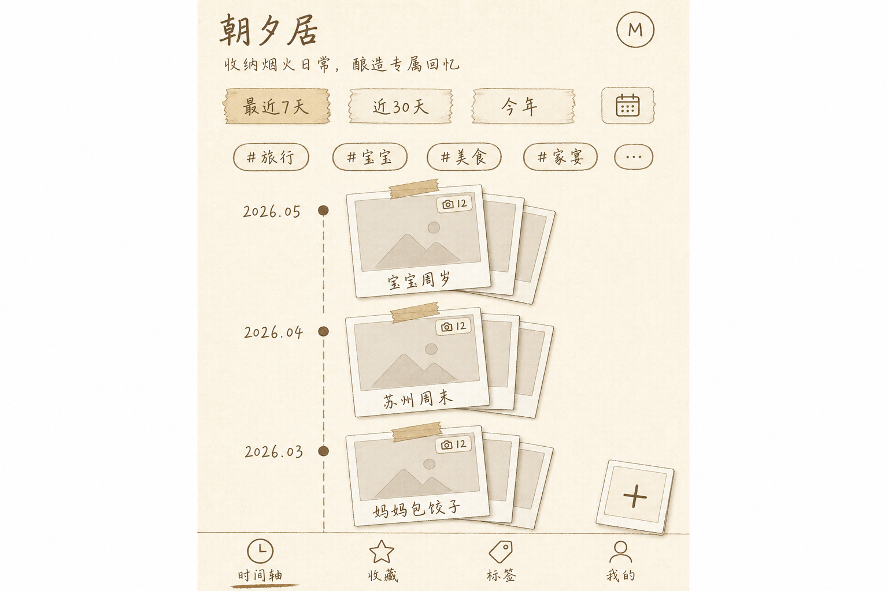

# 慢慢记 · 微信小程序 v1 设计文档

> 写于 2026-05-22。本文是端上展示能力建设第一阶段（微信小程序）的设计基线（spec），用于驱动后续实现计划（plan）的编写。
>
> 父项目 spec：[`2026-05-20-day-nest-design.md`](./2026-05-20-day-nest-design.md)
>
> Status: **draft · awaiting review**

---

## 目录

- [§0 立意 & 目标 / 非目标](#0-立意--目标--非目标)
- [§1 架构](#1-架构)
- [§2 鉴权流程](#2-鉴权流程)
- [§3 页面树 & 分包策略](#3-页面树--分包策略)
- [§4 视觉系统](#4-视觉系统)
- [§5 上传链路](#5-上传链路)
- [§6 后端 API & Schema Diff](#6-后端-api--schema-diff)
- [§7 构建 / 审核 / 发布 / QA](#7-构建--审核--发布--qa)
- [§8 开放问题、风险与非目标](#8-开放问题风险与非目标)
- [附录 A · 决策记录](#附录-a--决策记录)
- [附录 B · 外部依赖时间线](#附录-b--外部依赖时间线)
- [附录 C · 视觉草图](#附录-c--视觉草图)

---

## §0 立意 & 目标 / 非目标

### 0.1 我要解决的事

慢慢记家庭照片记忆，目前只能在 web 看。家人日常用微信，**进出 web 站要跳浏览器 + 输密码 + 不能从相册直接传**，这层摩擦让 daynest 在「随手记一笔家庭日常」场景上被冷落。

小程序的价值是把慢慢记塞进微信对话流里——长辈在群里聊到「上次去苏州那次」可以一秒打开看，妈妈做完饭手机相册多了几张就能直接传。

### 0.2 v1 用户故事

| Persona | 故事 |
|---|---|
| **奶奶**（看图人格） | 从家族群里点开「慢慢记」名片 → 进入时光轴 → 滑到「小宝周岁」集合 → 拍立得轮播 + 双指放大照片 |
| **妈妈**（生产者人格） | 相册多了 8 张家宴照片 → 长按桌面小程序 → 「上传」 → 选 8 张 → 起标题 → 自动按 EXIF 排时间 → 打几个标签 → 完成 |
| **爸爸**（管理者人格） | 邀请姑姑加入家庭 → 邀请链接生成 → 转发到「慢慢记」名片 → 姑姑微信快登 → 输入接收方的 daynest 账密完成绑定 |

### 0.3 目标（Goals）

- 与 web 端**功能等价**：登录/注册/邀请 · 时光轴 · 集合详情 · 拍立得照片浏览（双指缩放） · 上传 · 标签管理 · 收藏 · 设置 · 个人信息编辑
- **微信原生体验**：微信快登 · 微信分享卡片 · 微信小程序消息订阅 · 从家族群一键进入
- **拍立得全套视觉**：手写体（按页字体子集化） · 拍立得相框 + 胶带贴纸 · 双指放大照片 · 集合卡片叠加
- **离线友好**：缓存最近 50 张照片缩略图，进入后即使没网也能看
- **暗夜模式**：跟随系统 `wx.getSystemInfo().theme`，可在设置里覆盖

### 0.4 非目标（Non-Goals）

完整清单见 [§8.4](#84-非目标明确放弃的事情)。摘要：

- ❌ 公众号 / 企业微信 / 字节小程序 / 抖音小程序
- ❌ iOS/Android 原生 App、iPad / Android 平板优化、智能电视投屏
- ❌ 视频上传、HEIC 原生展示、EXIF GPS 入库、客户端 SHA 去重、断点续传
- ❌ 复杂的「时空快筛」（简化为 7天/30天/今年 + 单日期 picker）
- ❌ Skyline 渲染、Worklet 高性能动画
- ❌ 评论 / 弹幕 / 文本微言（v2 候选）
- ❌ 长期订阅消息、模板消息（个人主体不支持）
- ❌ 引入 PostgreSQL / 微信云开发 / Redis / 队列系统
- ❌ 「家庭」多租户隔离（v1 = 所有用户同属一个家庭）

### 0.5 关键约束

- 主包 ≤ 2 MB，总包 ≤ 20 MB
- 所有网络域必须在微信公众平台白名单（API + Qiniu 上传/取图 + 微信 API，共 5 个）
- 服务器必须 HTTPS（现状已满足）
- 微信 AppID + AppSecret 由个人主体注册

---

## §1 架构

### 1.1 Monorepo 落点

```
day_nest/
├── apps/
│   ├── api/                  # 扩展（+5 路由，+2 字段，+1 表）
│   ├── web/                  # 不动
│   └── miniapp/              # 新增 ← 微信小程序
│       ├── miniprogram/
│       │   ├── app.ts
│       │   ├── app.json
│       │   ├── app.wxss
│       │   ├── pages/             # 主包页面（4 tab + login + bind）
│       │   ├── pkgOnboarding/     # 分包：register
│       │   ├── pkgCollection/     # 分包：集合详情 + 照片浏览
│       │   ├── pkgUpload/         # 分包：上传链路
│       │   ├── pkgTags/           # 分包：标签管理 + 重命名
│       │   ├── components/        # 全局组件（polaroid、custom-tabbar）
│       │   ├── lib/               # api / auth / store / wechat
│       │   ├── styles/            # 字体、变量、动画 keyframes
│       │   └── assets/            # 子集化字体、SVG 装饰、纹理
│       ├── typings/
│       ├── tsconfig.json
│       ├── project.config.json
│       └── package.json
├── packages/
│   └── shared/               # 扩展（+wechat.ts, +design-tokens.ts）
└── scripts/
    ├── font-subset/          # pyftsubset 字体子集化
    └── check-package-size.mjs   # 主包/总包大小校验
```

### 1.2 编译/构建链

```
TypeScript 源码 (miniapp/miniprogram/**/*.ts)
    ↓ tsc --watch
WXML/WXSS/JSON（手写）+ 编译后 .js
    ↓
微信开发者工具实时预览 / miniprogram-ci 上传体验版
```

工具链：
- **TypeScript** — 与 web 共用 strict 配置；`tsconfig.paths` 指向 `packages/shared`
- **`miniprogram-ci`** — 命令行上传体验/审核
- **`fonttools` (pyftsubset)** — 字体按页子集化
- **可选：`vant-weapp`** — 仅引 picker/dialog 等基础交互组件，不引样式

### 1.3 跨端代码复用策略

| 资源 | 复用方式 |
|---|---|
| 类型定义（CollectionDTO/PhotoDTO/UserDTO/TagDTO） | `packages/shared` npm workspace 链接 |
| Zod schema 校验 | 抽到 `packages/shared/validators`，双端共用 |
| API 端点常量 | `packages/shared/endpoints.ts` 新增 |
| 设计 token（颜色 / 阴影） | `packages/shared/design-tokens.ts` 新增 |
| UI 组件 | **不复用**——WXML ≠ JSX |
| 状态管理 | 不复用 zustand，**小程序用自研轻量 store** |
| 样式 | CSS 变量复用调色板，WXSS 单独写 |

### 1.4 状态管理

**自研轻量 store**（~150 行，零依赖）。只允许 3 个全局 store：

- `authStore` — 当前用户、accessToken、refreshToken
- `themeStore` — light/dark/system
- `uploadQueueStore` — 上传任务（跨页面查看进度）

其他走页面本地 `data`。API 草图：

```typescript
export const authStore = createStore({
  state: { user: null as UserDTO | null, accessToken: '' },
  actions: { setUser(u) { ... }, logout() { ... } },
});

Page({
  onLoad() {
    this.unsub = authStore.subscribe((s) => this.setData({ user: s.user }));
  },
  onUnload() { this.unsub(); },
});
```

### 1.5 API Client 设计

`miniapp/miniprogram/lib/api.ts`，封装 `wx.request`：

1. 自动注入 `Authorization: Bearer <accessToken>`（从 authStore 读）
2. 401 自动 refresh：拦截 401 → 调 `POST /api/auth/refresh-token`（**body 模式**）→ 重试一次 → 仍失败跳登录页
3. 请求并发去重：refresh 期间所有其他 401 hold 住等同一个 refresh 完成
4. 离线降级：`wx.getNetworkType()` 无网时 GET 请求尝试 `wx.getStorage` 兜底
5. TS 强类型：`api.collections.list(params): Promise<CollectionSummaryDTO[]>`

### 1.6 与现有后端的交互边界

| 操作 | 复用现有 | 需新增 |
|---|---|---|
| 浏览（list/detail）、标签、收藏、个人信息、上传 token、Qiniu 直传、追加照片、编辑/删除照片 | ✅ 全部复用 | — |
| 登录 | ❌ | `POST /api/auth/wechat-login` |
| 绑定 | ❌ | `POST /api/auth/wechat-bind` |
| 邀请注册 | 扩展 | `POST /api/auth/wechat-register` |
| 解绑 | ❌ | `POST /api/auth/wechat-unbind` |
| Refresh | ⚠️ cookie 路径不可用 | `POST /api/auth/refresh-token`（body） |
| 订阅消息授权 | ❌ | `POST /api/wechat/subscribe` |
| 订阅消息发送 | ❌ | 内部触发器（业务事件 fire-and-forget） |

**后端改动估算约 1230 行**（详见 §6.9）。

---

## §2 鉴权流程

### 2.1 入口分流

进入小程序时，用 **`wx.checkSession()` + 本地 `authStore.accessToken`** 双重判断：

```
              app.onLaunch
                   │
       ┌───────────┼───────────┐
       ▼           ▼           ▼
   有 token    有 token       无 token
   且未过期   但已过期      （首次/退出后）
       │           │           │
       ▼           ▼           ▼
    进首页    refresh 后    跳 LoginPage
              进首页
```

### 2.2 三种场景

#### 场景 A：「老用户回来」（最常见，预计 ~90% 流量）

```
[LoginPage] → 单大按钮"微信一键进入"
     ↓ wx.login() → code
     ↓ POST /api/auth/wechat-login { code }
     ↓ 后端 sns/jscode2session → openid 命中 User 表
     ↓ 200 { bound: true, user, accessToken, refreshToken }
     ↓ 写入 authStore + wx.setStorage
     ↓ wx.reLaunch /pages/timeline
```

#### 场景 B：「新人首次绑定」

```
[LoginPage] → "微信一键进入"
     ↓ POST /api/auth/wechat-login { code }
     ↓ 后端 openid 未命中 → 签发 bindToken（JWT, 5min）
     ↓ 200 { bound: false, bindToken }
     ↓ 跳 [BindPage]：输入 daynest username + password
     ↓ POST /api/auth/wechat-bind { bindToken, username, password }
     ↓ 后端验证 → UPDATE user SET wechatOpenId = openid
     ↓ 签发 access + refresh
     ↓ Toast 成功 → 进首页
```

#### 场景 C：「没账号的新人」（邀请进来但无 daynest 账号）

BindPage 提供"我还没有慢慢记账号"链接 → `[RegisterPage]`：
- 输入 inviteToken（从分享链接解析自动填）+ 用户名 + 展示名 + 密码
- `POST /api/auth/wechat-register`（**新增**，等价 `/register` + 立刻绑 openid）

### 2.3 Token 生命周期

| Token | 存放 | 有效期 | 用途 |
|---|---|---|---|
| `accessToken` | authStore 内存 + `wx.setStorageSync('access', token)` | 15 min | 每个 API 请求 Header |
| `refreshToken` | 仅 `wx.setStorageSync('refresh', token)` | 30 day | 续期专用 |
| `bindToken` | BindPage 内存（不持久化） | 5 min | 仅绑定流程 |

与 web 端区别：refreshToken 不放 HttpOnly cookie，直接 body 收发——因为 `wx.request` 对跨请求 cookie 处理不可靠。`wx.storage` 在 iOS/Android 沙盒隔离，安全级别等同 HttpOnly cookie。

**Refresh 不轮换**（v1 决定）：旧 refreshToken 在 30 天有效期内可重复用。轮换 + 黑名单留给 v2。

### 2.4 退出登录

| 操作 | 表现 |
|---|---|
| 用户在「我的」点退出 | 清 storage + authStore，跳 LoginPage |
| 用户解绑微信 | 调 `POST /api/auth/wechat-unbind`，清 `wechatOpenId`，触发退出 |
| Web 端改密码 | 现有 refreshToken 不立即失效（沿用现有） |

### 2.5 微信「切号」边界 case

**v1 不做运行时切号检测**——爸爸的手机偶尔给妈妈用，accessToken 过期前（≤15 min）B 可能看到 A 的照片。家庭场景下接受这一容忍。

---

## §3 页面树 & 分包策略

### 3.1 TabBar（自定义）

底部 4 个 tab，全部在主包，**custom tabBar**（默认 tabBar 视觉与拍立得风冲突）：

| 名称 | 路径 | 对应 web |
|---|---|---|
| 时光轴 | `/pages/timeline/index` | TimelinePage |
| 收藏 | `/pages/favorites/index` | FavoritesPage |
| 标签 | `/pages/tags/index` | TagsOverviewPage |
| 我的 | `/pages/me/index` | SettingsPage |

**上传不作为 tab**——以「时光轴右上 + 集合详情 + 我的浮动按钮」三个入口出现，更符合"随手记"心智。

### 3.2 全部页面清单

| 路径 | 包 | web 对照 | 关键点 |
|---|---|---|---|
| `pages/login/index` | 主 | LoginPage | 微信快登入口 |
| `pages/bind/index` | 主 | — | 绑定 daynest 账号 |
| `pages/timeline/index` | 主 | TimelinePage | 时空快筛 + 集合卡片叠加 |
| `pages/favorites/index` | 主 | FavoritesPage | 收藏照片网格 |
| `pages/tags/index` | 主 | TagsOverviewPage | 标签云 + scope 切换 |
| `pages/me/index` | 主 | SettingsPage | 个人信息 + 主题 + 设置聚合 |
| `pages/profile/index` | 主 | — | 展示名编辑（用户决定放主包） |
| `pages/invites/index` | 主 | InviteManagePage | 邀请码（用户决定放主包） |
| `pkgOnboarding/register/index` | 分包 A | — | 注册流程 |
| `pkgCollection/detail/index` | 分包 B | CollectionDetailPage | 集合 + 网格 |
| `pkgCollection/viewer/index` | 分包 B | PhotoViewerOverlay | 全屏 swiper + 双指缩放 |
| `pkgUpload/pick/index` | 分包 C | UploadPage 第 1 步 | chooseMedia |
| `pkgUpload/meta/index` | 分包 C | UploadPage 第 2 步 | 标题/日期/标签 |
| `pkgUpload/progress/index` | 分包 C | UploadPage 进度 | 上传队列 |
| `pkgTags/pinboard/index` | 分包 D | TagPinboardPage | 标签下集合 |
| `pkgTags/rename/index` | 分包 D | （内联） | 标签重命名/合并 |

### 3.3 分包大小预估

| 包 | 内容 | 预估 |
|---|---|---|
| 主包 | login+bind+4tab+profile+invites + 公共组件 + 字体公共子集 | ~1.5 MB |
| pkgOnboarding | register | ~80 KB |
| pkgCollection | detail + viewer + 字体扩展子集 | ~600 KB |
| pkgUpload | pick + meta + progress + exifr lite | ~400 KB |
| pkgTags | pinboard + rename + 软木板纹理 | ~250 KB |
| **总计** | | **~2.85 MB** |

主包 1.5 MB < 2 MB 限制，留 500 KB 余量。

### 3.4 分包预下载

```json
{
  "preloadRule": {
    "pages/timeline/index": {
      "network": "wifi",
      "packages": ["pkgCollection", "pkgUpload"]
    },
    "pages/me/index": {
      "network": "all",
      "packages": []
    }
  }
}
```

- 时光轴 + wifi → 静默预拉 collection + upload 包
- 标签包按需加载（点了再下，~250KB / 4G 约 1s）

### 3.5 渲染引擎

**全部使用默认 WebView 渲染**（不上 Skyline）。理由：奶奶 persona 用旧版微信，Skyline 兜底成本过高（+400 行）。代价：双指缩放 30-40fps、拍立得拖拽用 CSS transition 无物理感。

### 3.6 导航选择

| 操作 | API |
|---|---|
| Tab 间切换 | `wx.switchTab` |
| 进入分包页 | `wx.navigateTo` |
| 登录成功 → 时光轴 | `wx.reLaunch` |
| 退出登录 → 登录页 | `wx.reLaunch` |
| 照片浏览全屏 | `wx.navigateTo`（非全屏 modal，便于手势返回 + 分享） |

最大深度：tab → 集合 → 照片浏览 → 标签编辑 = 4 层，远低于微信 10 层栈限制。

---

## §4 视觉系统

### 4.1 调色板（与 web 端共享）

抽到 `packages/shared/design-tokens.ts`：

```typescript
export const tokens = {
  paper: { cream: '#FBF4E4', aged: '#F3E6CB', sepia: '#A88B5C' },
  ink:   { primary: '#2A2520', secondary: '#6E5F4E', sticker: '#D4523A' },
  dark:  { /* 反色 */ },
  shadow: {
    polaroid:  '0 2px 4px rgba(0,0,0,.08), 0 8px 20px rgba(0,0,0,.12)',
    sticker:   '0 1px 2px rgba(0,0,0,.15)',
  },
};
```

构建脚本生成 `app.wxss` `:root` 和 `.dark` 两套 CSS 变量。

### 4.2 字体子集化

#### 角色与字体

| 角色 | 字体 | 打包 |
|---|---|---|
| 手写体（标题、集合名、时间戳） | **霞鹜文楷 LX**（开源） | 子集化打包 |
| 正文 | 苹方 / HarmonyOS Sans | 用系统 `system-ui` 不打包 |
| 数字（日期戳） | Caveat / Patrick Hand | 子集化打包（仅 ASCII） |

#### 分阶段子集

```
public-subset.woff2    ── 主包，≤250 KB
   3500 字 GB2312 一级 + 拍立得场景高频 + ASCII

extended-subset.woff2  ── pkgCollection 分包，≤200 KB
   3000 字 GB2312 二级

dynamic-fallback       ── 超纲字符回退 system-ui
```

#### 实施步骤

```bash
brew install fonttools

pyftsubset LXGWWenKaiLite.ttf \
  --unicodes-file=scripts/font-subset/gb2312-level1.txt \
  --output-file=apps/miniapp/miniprogram/assets/fonts/wenkai-base.woff2 \
  --flavor=woff2
```

CI 校验文件大小，超限即 fail。

#### 加载时机

`app.onLaunch` 中 `wx.loadFontFace` 异步加载主包字体。FOUT 期间用 fallback `system-ui`，本地加载 <100ms，几乎不可察。

### 4.3 拍立得相框（WXSS 实现）

不依赖图片，全部用 box-shadow + border + ::after：

```css
.polaroid {
  position: relative;
  padding: 12rpx 12rpx 80rpx 12rpx;
  background: #FFFCF5;
  box-shadow: 0 2rpx 4rpx rgba(0,0,0,.08), 0 16rpx 32rpx rgba(0,0,0,.12);
  border-radius: 4rpx;
  transform: perspective(800rpx) rotateX(2deg);
}
.polaroid::after {
  content: '';
  position: absolute;
  top: -20rpx; left: 50%;
  width: 120rpx; height: 40rpx;
  background: linear-gradient(180deg, rgba(212,182,140,.7), rgba(212,182,140,.4));
  transform: translateX(-50%) rotate(-2deg);
}
```

照片宽高比统一 4:3 强制 `object-fit: cover`——竖图会被裁。viewer 双指放大不裁，且右上 ⋯ 菜单提供「查看原图」走 `wx.previewImage`。

### 4.4 装饰元素清单

| 元素 | 实现 | 大小 |
|---|---|---|
| 胶带（4 种角度 + 4 种颜色） | WXSS gradient + transform | 0 KB |
| 便签纸、心形（收藏） | SVG inline | <3 KB |
| 软木板纹理（标签 pinboard） | base64 内嵌 noise tile（48×48 平铺） | ~6 KB |
| 时光轴竖虚线 | WXSS dashed border + custom pattern | 0 KB |
| 拍立得日期戳印章 | WXSS box-shadow + Caveat | 0 KB |
| Loading 抖动动画 | WXSS keyframes | 0 KB |

**总装饰资源 < 15 KB**。

### 4.5 暗夜模式

```typescript
export const themeStore = createStore({
  state: { mode: 'system', resolved: 'light' },
  actions: {
    setMode(mode) { this.state.mode = mode; this.resolve(); },
    resolve() {
      const sys = wx.getSystemInfoSync().theme;
      this.state.resolved = this.state.mode === 'system' 
        ? (sys || 'light') 
        : this.state.mode;
    },
  },
});

App({
  onLaunch() {
    themeStore.resolve();
    wx.onThemeChange(() => themeStore.resolve());
  },
});
```

每个页面在 onShow 给根元素打 `dark` class，WXSS 通过 `.dark .polaroid { ... }` 覆盖。

### 4.6 双指缩放（无 Skyline 降级方案）

纯 JS 处理 touch 事件：

```typescript
Page({
  onTouchStart(e) {
    if (e.touches.length === 2) {
      initialDistance = distance(e.touches[0], e.touches[1]);
      initialScale = currentScale;
    }
  },
  onTouchMove(e) {
    if (e.touches.length === 2) {
      const dist = distance(e.touches[0], e.touches[1]);
      currentScale = clamp(initialScale * (dist / initialDistance), 1, 4);
      this.setData({ scaleTransform: `scale(${currentScale})` });
    }
  },
});
```

性能：iPhone X 实测 30-40fps。长按或 ⋯ 菜单 → 调起 `wx.previewImage` 60fps 兜底。

### 4.7 拍立得叠加（StackedPolaroid 移植）

```html
<view class="stack">
  <view class="stack__back stack__back--3" 
        style="transform: translate(8rpx,12rpx) rotate(3deg);"
        wx:if="{{photoCount >= 3}}">
    <image src="{{previewPhotos[2].thumb}}" mode="aspectFill" lazy-load />
  </view>
  <view class="stack__back stack__back--2" ...>...</view>
  <view class="stack__top">...</view>
</view>
```

WXSS keyframes 入场：

```css
.stack__top { animation: stack-pop .4s cubic-bezier(.34, 1.56, .64, 1); }
@keyframes stack-pop {
  0%   { transform: scale(.9) translateY(10rpx); opacity: 0; }
  100% { transform: scale(1)   translateY(0);     opacity: 1; }
}
```

照片角度按 `photoId` 哈希定（避免每次 setData 重渲染抖动）。胶带颜色同样按 hash 取 4 种变体之一。

### 4.8 时光轴竖线对齐

用 grid 布局，竖线 `<view class="rail">` 在第一列固定 24rpx 宽，点放在 `left: 12rpx; transform: translateX(-50%)`。

### 4.9 设计资源交付清单

- [ ] 霞鹜文楷 LX TTF 源文件
- [ ] GB2312 一级 + 二级字符表
- [ ] 4 张 SVG 装饰：心形、胶带、便签、印章框
- [ ] 软木板纹理底图（48×48 PNG → base64）
- [ ] tabBar 4 个图标（选中/未选中 8 张 PNG ~30KB）
- [ ] App 启动图 / Logo（审核要求）
- [ ] 小程序分享卡片设计稿（5:4，500×400）

---

## §5 上传链路

### 5.1 三步漏斗

```
[pick]    选照片        → wx.chooseMedia (count<=9, sizeType:'original')
                            ↓
[meta]    填元信息      → 读 EXIF / 模糊匹配集合 / 选/打标签
                            ↓
[progress] 上传队列     → 申请 token → JS 压缩 → 直传 Qiniu → 完成 commit
```

三步分别对应 `pkgUpload/pick`、`pkgUpload/meta`、`pkgUpload/progress`。**任意一步退出不丢已上传部分**，上传在后台继续。

### 5.2 第一步：pick

```typescript
wx.chooseMedia({
  count: 9,
  mediaType: ['image'],
  sourceType: ['album', 'camera'],
  sizeType: ['original'],       // ★ 拿原图保 EXIF
  success: async (res) => {
    const tokens = await api.uploads.getTokens({
      count: res.tempFiles.length,
      collectionDraftId: draftId,
    });
    // 跳 meta 页
  },
});
```

**用户决定 EXIF 严格读取**：`sizeType: 'original'` 拿到原图，不依赖微信压缩。

### 5.3 第二步：meta — EXIF + 元信息

```typescript
import exifr from 'exifr/dist/lite.umd.js';  // ~20KB

async function readExif(tempFilePath: string) {
  const fs = wx.getFileSystemManager();
  const buf = await new Promise<ArrayBuffer>((resolve, reject) =>
    fs.readFile({ filePath: tempFilePath, success: r => resolve(r.data as ArrayBuffer), fail: reject })
  );
  return exifr.parse(buf, ['DateTimeOriginal', 'Orientation']);
}
```

仅读 2 个字段（**不读 GPS**）。GPS 即使能读也不入库。

#### 模糊匹配现有集合

复用 web 的 `useCollectionByTitle` 逻辑——IME-aware debounce + `GET /api/collections?title=xxx`。

#### meta 页布局

```
顶部：横向预览条（缩略图，可点删除）
表单：
  标题  [____________]   ← 实时模糊匹配现有集合
  日期  [📅 ...]          ← 默认 = 第一张 EXIF takenAt，否则今天
  地点  [___________]
  标签  [#旅行] [+]      ← 同 web
底部：[预览上传] 按钮
```

### 5.4 第三步：progress — 上传队列

#### Store

```typescript
interface UploadTask {
  id: string;
  draftId: string;
  filePath: string;
  fileKey: string;
  uploadToken: string;
  state: 'queued' | 'uploading' | 'done' | 'failed';
  progress: number;
  bytesSent: number;
  retries: number;
  error?: string;
}

export const uploadQueueStore = createStore({
  state: { tasks: [], maxConcurrent: 10 },  // ★ 用户决定 10（实施时可调，建议 5）
  actions: {
    enqueue(tasks) { ... },
    schedule() { ... },
    execute(task) {
      const wxTask = wx.uploadFile({
        url: 'https://upload.qiniup.com',
        filePath: task.filePath,
        name: 'file',
        formData: { key: task.fileKey, token: task.uploadToken },
        success: () => this.markDone(task.id),
        fail: () => this.handleFailure(task.id),
      });
      wxTask.onProgressUpdate(p => this.updateProgress(task.id, p.progress));
      task._wxTask = wxTask;
    },
    handleFailure(taskId) {
      const task = ...;
      if (task.retries < 2) {
        task.retries++;
        task.state = 'queued';
        setTimeout(() => this.schedule(), 1000 * 2 ** task.retries);
      } else {
        task.state = 'failed';
      }
    },
  },
});
```

#### 压缩流程（EXIF 后、上传前）

逐张处理避免 OOM：

```
fileType === 'jpg'        → wx.compressImage(src, quality: 75)
fileType === 'heic'/'png' → canvas 2d.drawImage + canvasToTempFilePath({ fileType: 'jpg', quality: .75 })
```

#### 进度页 UI

```
┌─────────────────────────────────┐
│ ← 上传中  4/9                   │
├─────────────────────────────────┤
│ ┌──────┐  小宝在公园               │
│ │ □ ✓ │  done · 820 KB          │
│ └──────┘                        │
│ ┌──────┐                        │
│ │ □ ▰▱│  62% · 510 KB / 820 KB  │
│ └──────┘                        │
│ ┌──────┐  ⚠️ 失败                │
│ │ □  ✗ │  [重试]                │
│ └──────┘                        │
└─────────────────────────────────┘
```

每个 task 显示为小拍立得 + 进度条。

#### 自动 commit

所有 task done 后：

```typescript
const collection = await api.collections.create({
  title, occurredOn, location, tags,
  photos: tasks.map((t, idx) => ({
    photoId: t.photoId,
    fileKey: t.fileKey,
    width: t.width,
    height: t.height,
    takenAt: t.exif?.takenAt ?? null,
    caption: null,
    orderIndex: idx,
  })),
});
wx.redirectTo({ url: `/pkgCollection/detail/index?id=${collection.id}` });
```

**复用现有 `POST /api/collections`**，后端零改动。

### 5.5 边界 case

| 场景 | 处理 |
|---|---|
| 进入后台 | iOS 5min 内 wx.uploadFile 仍执行；超过失败，可重试 |
| 切到其他 tab | 上传继续 |
| 同张选两次 | v1 不去重 |
| EXIF 缺失 | 默认今天 |
| 用户在 progress 删除某张 | `task.abort()` + 队列移除 + `DELETE /api/photos/:id` 兜底 |
| 网络从 wifi 切 4G | 不打断（v1 不做「仅 wifi」开关） |
| 全部失败 | 「全部重试」按钮 |

### 5.6 OOM 风险防护

`sizeType: 'original'` 取原图 + JS 压缩流程**必须逐张处理**：一次只读一张 ArrayBuffer，处理完释放再读下一张，**不一次性把 9 张读到内存**。

---

## §6 后端 API & Schema Diff

### 6.1 Prisma Schema 改动

```diff
 model User {
   id            String   @id @default(uuid())
   username      String   @unique
   displayName   String
   passwordHash  String
   avatarKey     String?
   createdAt     DateTime @default(now())
+  wechatOpenId  String?  @unique
+  wechatBoundAt DateTime?

   collections   Collection[]    @relation("CollectionCreator")
   ...
+  wechatSubs    WechatSubscription[]
 }

+ model WechatSubscription {
+   id          String   @id @default(uuid())
+   userId      String
+   user        User     @relation(fields: [userId], references: [id], onDelete: Cascade)
+   templateId  String
+   quota       Int      @default(0)
+   updatedAt   DateTime @updatedAt
+   @@unique([userId, templateId])
+   @@index([userId])
+ }
```

故意没加的字段：
- ❌ `wechatUnionId` — 个人主体申请不到
- ❌ `wechatNickname` / `wechatAvatarUrl` — 微信 2022 政策后默认匿名
- ❌ refresh token rotation 黑名单（已决定不做）

### 6.2 Migration SQL

新建 `apps/api/prisma/migrations/2026MMDD_add_wechat_binding/migration.sql`：

```sql
ALTER TABLE "User" ADD COLUMN "wechatOpenId" TEXT;
ALTER TABLE "User" ADD COLUMN "wechatBoundAt" DATETIME;
CREATE UNIQUE INDEX "User_wechatOpenId_key" ON "User"("wechatOpenId");

CREATE TABLE "WechatSubscription" (
  "id" TEXT PRIMARY KEY,
  "userId" TEXT NOT NULL REFERENCES "User"("id") ON DELETE CASCADE,
  "templateId" TEXT NOT NULL,
  "quota" INTEGER NOT NULL DEFAULT 0,
  "updatedAt" DATETIME NOT NULL
);
CREATE UNIQUE INDEX "WechatSubscription_userId_templateId_key"
  ON "WechatSubscription"("userId", "templateId");
CREATE INDEX "WechatSubscription_userId_idx"
  ON "WechatSubscription"("userId");
```

无数据回填——现有用户 `wechatOpenId` 全 NULL，下次小程序登录走绑定。

### 6.3 配置项

```diff
# apps/api/.env
+ WECHAT_APPID=wx________________
+ WECHAT_APP_SECRET=__________________
+ WECHAT_ACCESS_TOKEN_CACHE_PATH=/var/lib/daynest/wx-token.json
```

`config.ts` 新增：

```typescript
wechat: {
  appId: process.env.WECHAT_APPID,
  appSecret: process.env.WECHAT_APP_SECRET,
  enabled: Boolean(process.env.WECHAT_APPID && process.env.WECHAT_APP_SECRET),
}
```

`enabled` 标志：开发环境未配密钥时小程序登录接口返回 503，避免 nil pointer。

### 6.4 微信 SDK 封装

新增目录 `apps/api/src/wechat/`：

```
wechat/
├── client.ts             # WechatClient 类
├── accessTokenCache.ts   # 进程内单例 + 文件持久化（2h 过期，提前 5min 刷新）
├── subscribe.ts          # 订阅消息发送
└── types.ts
```

`WechatClient` 核心方法：

```typescript
class WechatClient {
  async jsCode2Session(code: string): Promise<{ openid: string; session_key: string; unionid?: string }>;
  async getAccessToken(): Promise<string>;
  async sendSubscribe(opts: { openid; templateId; page?; data }): Promise<void>;
}
```

### 6.5 新增路由

| 方法 | 路径 | 鉴权 | 作用 |
|---|---|---|---|
| POST | `/api/auth/wechat-login` | 无 | 接收 jscode，返回 `bound:true` + tokens **或** `bound:false` + bindToken |
| POST | `/api/auth/wechat-bind` | 无 | bindToken + daynest 账密 完成绑定 |
| POST | `/api/auth/wechat-register` | 无 | bindToken + inviteToken 一步注册 + 绑定 |
| POST | `/api/auth/wechat-unbind` | requireUser | 清除 wechatOpenId |
| POST | `/api/auth/refresh-token` | 无（body 带 refreshToken） | 取代 cookie 模式 |
| POST | `/api/wechat/subscribe` | requireUser | 记录订阅授权（quota+1） |

#### `POST /api/auth/wechat-login`

```typescript
export const WechatLoginInput = z.object({
  code: z.string().min(8).max(64),
});

export type WechatLoginResponse =
  | { bound: true; user: UserDTO; accessToken: string; refreshToken: string }
  | { bound: false; bindToken: string };
```

#### `POST /api/auth/wechat-bind`

```typescript
export const WechatBindInput = z.object({
  bindToken: z.string(),
  username: z.string().min(1).max(64),
  password: z.string().min(1),
});

export type WechatBindResponse = {
  user: UserDTO;
  accessToken: string;
  refreshToken: string;
};
```

错误码：
- `BIND_TOKEN_EXPIRED` / `BIND_TOKEN_INVALID`
- `BAD_CREDENTIALS`
- `ALREADY_BOUND` — 该 daynest 账号已绑定其他微信
- `OPENID_TAKEN` — 该微信已绑定其他 daynest 账号（罕见）

#### `POST /api/auth/wechat-register`

```typescript
export const WechatRegisterInput = z.object({
  bindToken: z.string(),
  inviteToken: z.string(),
  username: z.string().min(2).max(64),
  displayName: z.string().min(1).max(64),
  password: z.string().min(6),
});
```

#### `POST /api/auth/refresh-token`

```typescript
export const RefreshTokenInput = z.object({ refreshToken: z.string() });
```

复用现有 `issueTokens` helper，差异仅在 cookie set vs body return。现有 `/api/auth/refresh` 保留（web 用）。

#### `POST /api/wechat/subscribe`

```typescript
export const SubscribeAuthInput = z.object({
  templateId: z.enum([
    'NEW_PHOTO_IN_FAMILY',
    'PHOTO_FAVORITED',
    'INVITE_ACCEPTED',
  ]),
  acceptedCount: z.number().int().min(1).max(5),
});
```

UPSERT WechatSubscription, `quota += acceptedCount`。

### 6.6 业务事件触发订阅消息

| 事件 | 触发点 | 收件人 | 模板 |
|---|---|---|---|
| 上传新集合 / 追加照片 | `POST /api/collections` / `POST /api/collections/:id/photos` 成功后 | 所有其他用户（v1 = 同一家庭） | NEW_PHOTO_IN_FAMILY |
| 收藏他人照片 | `POST /api/photos/:id/favorite` | 照片上传者 | PHOTO_FAVORITED |
| 邀请被消费 | `consumeInvite` 末尾 | 邀请发起人 | INVITE_ACCEPTED |

**fire-and-forget**：在 service 末尾异步触发，不阻塞响应，单条失败不影响其他。**用户操作即使微信宕机也不失败**。

```typescript
import { trySendSubscribe } from '../wechat/subscribe.js';

export async function appendToCollection(...) {
  // ... 现有逻辑

  void trySendSubscribe.newPhotoInFamily({
    excludeUserId: req.user.id,
    collectionTitle: collection.title,
    count: newPhotos.length,
  });

  return result;
}
```

### 6.7 `packages/shared` 类型更新

```diff
 // packages/shared/auth.ts
 export type UserDTO = {
   id: string;
   username: string;
   displayName: string;
   avatarKey: string | null;
+  hasWechatBound: boolean;
 };
```

注意：**只暴露 boolean**，不暴露 openid 任何片段（隐私边界）。

新增 `packages/shared/wechat.ts`：

```typescript
export const WechatLoginInput = ...;
export type WechatLoginResponse = ...;
export const WechatBindInput = ...;
export const WECHAT_TEMPLATES = {
  NEW_PHOTO_IN_FAMILY: 'NEW_PHOTO_IN_FAMILY',
  PHOTO_FAVORITED: 'PHOTO_FAVORITED',
  INVITE_ACCEPTED: 'INVITE_ACCEPTED',
} as const;
```

### 6.8 Refresh cookie 路径

`POST /api/auth/refresh`（cookie）保留，web 用。`POST /api/auth/refresh-token`（body）新增，小程序用。两条路径共享 `issueTokens` helper。等到 web 也迁到 body 模式时可删除 cookie 路径（v2 候选）。

### 6.9 工作量预估

| 模块 | 行数估算 |
|---|---|
| Prisma schema + migration | ~30 |
| `wechat/client.ts` + `accessTokenCache.ts` | ~250 |
| `wechat/subscribe.ts` + 各 service 集成 | ~150 |
| 5 个新路由 | ~300 |
| 错误码补充 | ~20 |
| `packages/shared/wechat.ts` | ~80 |
| 单元测试 | ~400 |
| **总计后端改动** | **~1230 行** |

### 6.10 测试覆盖

新增：
- `apps/api/tests/wechatAuth.test.ts` — login/bind/register/unbind/refresh 全路径，mock `WechatClient`
- `apps/api/tests/wechatSubscribe.test.ts` — 触发逻辑、quota 扣减、并发
- `apps/api/tests/refreshTokenBody.test.ts` — body 模式 refresh

`WechatClient` 用接口 + 测试注入 mock 实现，不发真请求。

---

## §7 构建 / 审核 / 发布 / QA

### 7.1 工具链

```
apps/miniapp/
├── package.json
│   scripts:
│     dev          → tsc -w
│     build        → tsc + fonts:subset + check-package-size
│     fonts:subset → node scripts/font-subset/build.mjs
│     upload:trial → miniprogram-ci 上传体验版
│     upload:audit → miniprogram-ci 提交审核
│   deps: typescript, miniprogram-ci, miniprogram-api-typings, exifr
├── project.config.json
│   appid: <env-injected>
│   setting.useCompilerPlugins: ["typescript"]
└── ci-key/  (gitignored)
    private.<appid>.key
```

### 7.2 字体子集脚本

`scripts/font-subset/build.mjs`（~80 行）：跑 `pyftsubset` 生成 woff2，校验文件大小，超限即 fail。

### 7.3 主包大小校验

`scripts/check-package-size.mjs` 挂到 `pnpm build` 末尾：

```javascript
const MAIN_LIMIT = 2 * 1024 * 1024;
const TOTAL_LIMIT = 20 * 1024 * 1024;
const mainSize = sumFiles('apps/miniapp/miniprogram', excludeSubpackages);
const totalSize = sumFiles('apps/miniapp/miniprogram');
if (mainSize > MAIN_LIMIT) throw new Error(`主包 ${mainSize}b > 2MB`);
if (totalSize > TOTAL_LIMIT) throw new Error(`总包 ${totalSize}b > 20MB`);
```

本地和 CI 都跑。

### 7.4 微信公众平台配置（手动一次性）

```
request 合法域名：
  - https://daynest.top
  - https://api.weixin.qq.com

uploadFile 合法域名：
  - https://upload.qiniup.com
  - https://upload-z2.qiniup.com (Qiniu 华南备用)

downloadFile 合法域名：
  - https://cdn.daynest.top
```

**5 个域名总数，剩 5 个 slot 给未来**。

**订阅消息模板**（在公众平台「一次性订阅」申请）：
- `NEW_PHOTO_IN_FAMILY` — {{thing1}} 成员名 / {{thing2}} 集合标题 / {{number3}} 照片数 / {{date4}} 时间
- `PHOTO_FAVORITED` — {{thing1}} 收藏者 / {{thing2}} 集合 / {{date3}} 时间
- `INVITE_ACCEPTED` — {{thing1}} 新成员 / {{date2}} 时间

模板审核 1-3 工作日。**关键路径阻塞点**，但订阅功能可后置一个小版本（v1.0.x）。

### 7.5 设备覆盖矩阵

| 设备 | 微信 | 优先级 |
|---|---|---|
| iPhone 12+ (iOS 16+) | 最新 | P0 |
| iPhone X/XS (iOS 14-15) | 最新 | P0（性能基线） |
| iPhone 6s/7 (iOS 12-13) | 最新 | P1（长辈机型） |
| Android 旗舰 (8GB+) | 最新 | P0 |
| Android 中低端 (3-4GB) | 最新 | P1（双指缩放基线） |
| iPad / Android 平板 | 最新 | P2/P3（不保证完美） |

性能 KPI：
- 冷启动到时光轴 ≤ 2s（iPhone X / WiFi）
- 集合详情打开 ≤ 1s（预下载后）
- 双指缩放 ≥ 24fps

### 7.6 灰度发布流程

```
1. 开发完成 → pnpm build → pnpm upload:trial → 体验版二维码
2. 100 人体验版（家庭 + 朋友）扫码内测，1-2 轮迭代
3. pnpm upload:audit → 公众平台「提交审核」→ 微信审核 1-3 工作日
4. 审核通过 → 「发布上线」
```

#### 审核易踩雷

- 必须提供「体验账号」给审核员 → 固定账号 `daynest-reviewer / daynest123`
- 必须有「用户须知 / 隐私政策」入口 → 设置页加 `/pages/legal/index`
- 不用「微信运动 / 位置」等权限 → 避免严格审核
- 不能有外链跳出小程序

### 7.7 监控与埋点

| 工具 | 用途 |
|---|---|
| 微信小程序数据助手（官方） | DAU、留存、性能、白屏率，零代码 |
| `wx.reportEvent` | v1 暂不接 |
| pino access log | 后端已有 |
| wechat-errors.log | `WechatClient` 错误集中日志 |

**v1 不上 Sentry / Datadog**。后端 pino + 微信官方助手够用。

### 7.8 协同发布顺序

```
1. 后端先发：migration + 新路由 + 新环境变量
   - 验证 web 端登录、上传无回归
2. 小程序后发：体验版 → 审核 → 上线
3. 回滚预案：
   - 小程序：公众平台「版本管理」一键回滚（< 1min）
   - 后端：git revert + 重新部署（migration 有 down 脚本）
```

### 7.9 QA 验收清单

详见原始设计讨论 §7.9，覆盖鉴权、浏览、上传、标签/收藏、订阅消息、性能五个维度。实施时据此逐项过。

### 7.10 发布后 1 月内指标目标

| 指标 | 目标 |
|---|---|
| 周活 ≥ 3 家庭成员 | ≥ 80% |
| 上传成功率 | ≥ 95% |
| 双指缩放卡顿用户报告 | ≤ 5% |
| 订阅消息发送成功率 | ≥ 90% |
| 微信审核版本迭代频次 | ≤ 1 次/周 |

---

## §8 开放问题、风险与非目标

### 8.1 实施前必须解决的外部依赖

| 依赖 | 责任 | 时长 | 阻塞 |
|---|---|---|---|
| 微信小程序 AppID（个人主体） | 你 | 半天 | ⚠️ 阻塞所有开发 |
| 业务域名配置（5 域） | 你 | 10 分钟 | 阻塞联调 |
| 订阅消息模板（3 模板） | 你 | 1-3 工作日 | 阻塞订阅联调（不阻塞 v1） |
| `WECHAT_APPID/SECRET` 注入生产 | 你 | 5 分钟 | 阻塞登录联调 |
| Qiniu 取图域 `cdn.daynest.top` 白名单 | 你 | 5 分钟 | 阻塞看图 |
| 霞鹜文楷 LX TTF | 实施时 | 10 分钟 | 阻塞视觉 |

详细时间线见[附录 B](#附录-b--外部依赖时间线)。

### 8.2 开放问题（implementation 阶段需要回答）

| ID | 问题 | 候选 | 影响 |
|---|---|---|---|
| OQ-1 | 超纲字符回退 system-ui 视觉割裂能接受吗 | (a) 接受 (b) 加 ext 字体 +200KB | 视觉一致性 |
| OQ-2 | 自定义 navBar 全页用 `navigationStyle: 'custom'` | 推荐用 | +1 day 工作量 |
| OQ-3 | tabBar custom 50-100ms 闪烁能接受吗 | 接受，about 页加版本提示 | UX 微伤 |
| OQ-4 | 小程序版本号管理 | 沿用 semver 独立计数 | 文档化 |
| OQ-5 | 是否上微信云开发取代自建后端 | 不上 | 已决定 |
| OQ-6 | iOS 后台 5 分钟 wx.uploadFile 是否需要断点续传 | v1 不做 | 已决定 |

### 8.3 风险登记

| 风险 | 概率 | 影响 | 缓解 |
|---|---|---|---|
| R1：个人主体审核被卡 | 中 | 高 | 准备清晰说明 + 体验账号 + 隐私政策；不写「企业级 / 商业 / 社交」 |
| R2：双指缩放在中低端 Android 卡顿 | 中 | 中 | 已有兜底：`wx.previewImage` |
| R3：字体加载 FOUT 闪烁 | 低 | 低 | 主包字体 250KB 本地，< 100ms 几乎不可察 |
| R4：Qiniu image 被微信拦截 | 低 | 高 | 域必须在 downloadFile 白名单 + HTTPS |
| R5：「一次性订阅」用户拒后不再弹 | 中 | 低 | 设置页加「重新订阅家人通知」按钮 |
| R6：小程序分享给陌生人，预览图暴露 | 低 | 中 | 分享卡片只显示品牌字「慢慢记 · 收纳烟火日常」，不带内容预览 |
| R7：用户忘记 daynest 密码无法绑定 | 中 | 中 | 设置页提供「在 web 端重置密码」链接 |
| R8：上传 9 大图 OOM 闪退 | 低 | 高 | 逐张处理 + 单实例 ArrayBuffer |
| R9：多设备同时操作冲突 | 低 | 低 | 最后写胜出，家庭场景频率低 |
| R10：access_token 进程重启失效触发限流 | 低 | 低 | 文件持久化恢复 |

### 8.4 非目标（明确放弃的事情）

> 此清单 = 实施时不要写、code review 时不要补、PR 评论里有人提也不要做的事情。

#### 平台与生态
- ❌ iOS/Android 原生 App（Swift/Kotlin/RN/Flutter）
- ❌ 字节小程序、支付宝小程序、抖音小程序
- ❌ iPad / Android 平板优化
- ❌ 智能电视投屏 / AirPlay
- ❌ 微信 Web-view 嵌入现有 web 页面
- ❌ 微信公众号文章嵌入

#### 鉴权
- ❌ Refresh Token Rotation + 黑名单
- ❌ 微信「切号」运行时检测
- ❌ unionid 体系（个人主体申请不到）
- ❌ 小程序内修改 daynest 密码（合规风险）
- ❌ 「登出所有设备」
- ❌ 多账号切换（一个微信 = 一个 daynest）

#### 上传 & 媒体
- ❌ 视频上传
- ❌ HEIC 原生展示（一律转 JPEG）
- ❌ EXIF GPS 入库
- ❌ 客户端 SHA 去重
- ❌ 断点续传
- ❌ 「仅 wifi 上传」开关
- ❌ 后台静默上传
- ❌ 自动同步相册到 daynest

#### 浏览 & 交互
- ❌ Skyline 渲染
- ❌ Worklet 高性能动画
- ❌ 自定义日期范围（简化为单日期 picker）
- ❌ 复杂时空快筛
- ❌ 60fps 双指缩放（接受 30-40fps）
- ❌ 拍立得叠加多于 3 张
- ❌ 评论 / 弹幕 / 表情（v2）
- ❌ 文本微言（v2）

#### 订阅消息 & 通知
- ❌ 长期订阅（个人主体不支持）
- ❌ 服务通知 / 模板消息
- ❌ 第三方推送 SDK

#### 后端
- ❌ PostgreSQL / MySQL（保持 SQLite）
- ❌ 微信云开发 / 云函数
- ❌ Redis 缓存
- ❌ 队列系统
- ❌ 「家庭」概念建模（v2 候选）
- ❌ 权限粒度

#### 视觉
- ❌ 多主题（仅 light + dark）
- ❌ 动态壁纸 / Lottie
- ❌ 自定义字体上传
- ❌ 全屏沉浸式照片墙

#### 工程
- ❌ Sentry / Datadog
- ❌ 单测覆盖率门槛
- ❌ E2E 测试
- ❌ 多人协作 git flow

### 8.5 v2+ 想法登记（不在 v1 实施）

1. 评论 / 留言
2. 文本微言
3. 打印拍立得（接小红书）
4. iOS Widget — 每天一张回忆
5. 生日 / 周年自动回顾
6. 家庭分组（多家庭隔离）
7. 导出 PDF 相册
8. AI 自动标签（BLIP / CLIP）
9. 微信「拍一拍」联动
10. 小程序 → APP 升级路径

---

## 附录 A · 决策记录

> 本节是 brainstorming 过程中所有 yes/no 决策的归集，方便后续读者快速理解"为什么是这样"。

| # | 决策点 | 选择 | 理由 |
|---|---|---|---|
| D1 | 平台 | 微信小程序 | 家庭场景在微信内 |
| D2 | v1 范围 | full parity | 全功能 |
| D3 | 实现技术栈 | 原生小程序（WXML/WXSS/TS） | 包体最小、官方文档准、与 React 生态零耦合 |
| D4 | 视觉野心 | 完整拍立得 | 与 web 端一致 |
| D5 | 发布节奏 | big-bang | 一波完整功能上线 |
| D6 | 鉴权方式 | 微信快登 + 首次绑 daynest 账号 | 体验最优 |
| D7 | 订阅消息推送 | v1 纳入 | 提升参与度 |
| D8 | 自定义日期范围 | 简化为单日期 picker | 小程序 UI 限制 |
| D9 | Token rotation | **不做** | 工作量 vs 安全收益不划算 |
| D10 | 微信「切号」检测 | **不做** | 家庭场景概率低 |
| D11 | 注册必须邀请码 | 沿用 web 模型 | 隐私 |
| D12 | Skyline 渲染 | **不上**，全 WebView | 兼容长辈旧微信 |
| D13 | 预下载分包 | wifi 下预拉 collection + upload | 用户体验 |
| D14 | profile/invites 分包 | **不分**，放主包 | 1.5MB 主包仍 < 2MB |
| D15 | 照片宽高比 | 4:3 强制 cover，viewer 不裁 | 拍立得感 |
| D16 | 自定义 tabBar | **写** | 视觉差距大 |
| D17 | EXIF 读取 | **严格读取**（original size） | 用户决定 |
| D18 | 上传并发数 | **10**（建议 5） | 用户决定 |
| D19 | 「仅 wifi 上传」开关 | **不做** | 用户决定 |
| D20 | `hasWechatBound` 字段 | 仅暴露 boolean | 隐私边界 |
| D21 | 订阅消息发送 | fire-and-forget | 解耦业务 |
| D22 | 「家庭」概念 | v1 简化为「所有用户」 | 暂无多家庭需求 |
| D23 | 体验版人数 | 申请扩到 100 | 家庭闭环 + 朋友试用 |

## 附录 B · 外部依赖时间线

```
T-0 (开发启动前)
├── 微信小程序 AppID 申请（个人主体）              [你, 半天]
├── 公众平台业务域名配置（5 域）                   [你, 10min]
└── 订阅消息模板申请（3 模板）                    [你, 提前 1-3 工作日]

T+0 (实施第一周)
├── 霞鹜文楷 LX TTF 准备                          [实施时, 10min]
├── pyftsubset 字体子集化                         [实施时, 1day]
└── miniprogram-ci 私钥下载 + .env 注入            [你+实施, 30min]

T+N (审核前)
├── WECHAT_APPID / WECHAT_APP_SECRET 注入生产 .env  [你, 5min]
└── 体验账号 daynest-reviewer 创建 + 数据准备       [实施时, 30min]
```

## 附录 C · 视觉草图

低保真草图，验证「全 WebView + 无 Skyline」下拍立得视觉的实际表现。



*图 1 · 时光轴。拍立得叠加 + 时光轴竖线 + 胶带 pill 滤镜 + 自定义 tabBar。*


*图 2 · 集合详情。大封面 polaroid + 网格里每张照片随机角度+随机胶带色。*


*图 3 · 照片浏览。单张照片占 C 位 + 左右滑动提示箭头 + 缩略图 strip + 底部三个动作。*

---

## 下一步（不在本 spec 范围内）

1. 你 review 本 spec，提改动
2. Review 通过后 → 启动 **writing-plans** skill，把 spec 转化为可执行的 task 列表 + 工时估算 + 依赖图（输出到 `docs/superpowers/plans/2026-MM-DD-miniapp-*.md`）
3. 实施

—— end of spec
